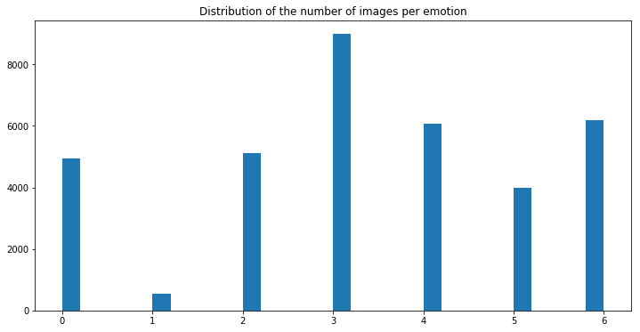

# Facial-Emotion-Recognition
The aim of this section is to explore facial emotion recognition techniques from a live webcam video stream.

## Data

The data set used for training is the **Kaggle FER2013** emotion recognition data set : https://www.kaggle.com/c/challenges-in-representation-learning-facial-expression-recognition-challenge/data

The data consists of 48x48 pixel grayscale images of faces. The faces have been automatically registered so that the face is more or less centered and occupies about the same amount of space in each image. The task is to categorize each face based on the emotion shown in the facial expression in to one of seven categories (0=Angry, 1=Disgust, 2=Fear, 3=Happy, 4=Sad, 5=Surprise, 6=Neutral).



## Requirements

```
Python : 3.6.2 
Torch : 1.1.0 
Torchvision : 0.3.0 
Numpy : 1.16.4 
OpenCV : 3.4.2
```

## Methodology

My aim is to develop a model able to provide a live emotion recognition with a visual user interface. I am therefore trying to display information in a clear way, and handle multi-face data.

### Video Processing

#### Pipeline

The video processing pipeline was built the following way :
- Launch the webcam
- Identify the face by Histogram of Oriented Gradients
- Zoom on the face
- Dimension the face to 48 * 48 pixels
- Make a prediction on the face using our pretrained model
- Also identify the number of blinks on the facial landmarks on each picture

#### Model

The model I have chosen is an XCeption model, since it outperformed the other models. I tuned the model with :
- data augmentation
- early stopping
- Class weight balancing

## V. How to use it ?

Run Prediction.ipynb for live demo. 

